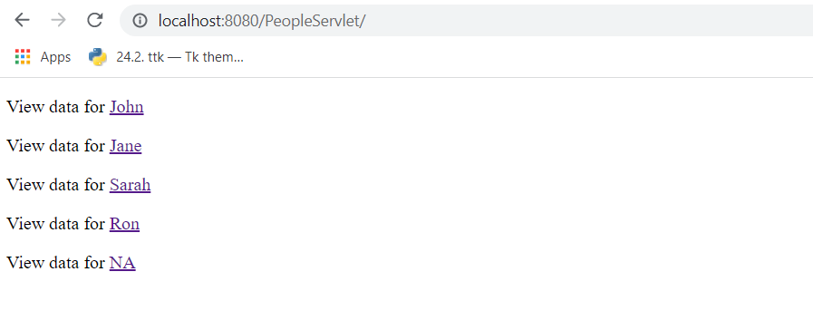
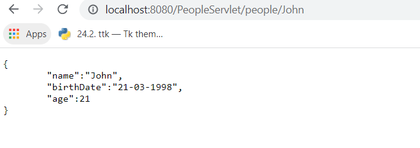
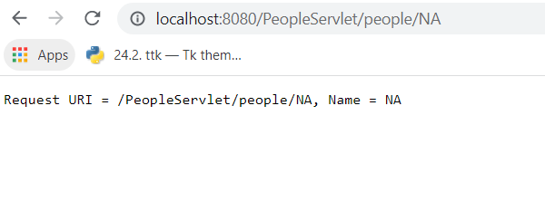

# Java-REST-API
## People Servlet

A "*DataStore*" map is used by a "*PeopleServlet*" to serve instances of "*Person*" data objects. Although the DataStore class supports putting new instance of Person, the PeopleServlet does not support POST requests only GET requests.

Example screenshots are below to show content

### Simple landing page

### Example Query

### Example Query NA

## MySQL World App

Simple query to the "country" table in the "world" database within MySQL. Standard query is to fetch the contintent, country and population size per million for all entries and store these in a tab separated table. Ideally the content JDBC ResultSet object will replace the DataStore, and then displayed on the front-end in a HTML table element.
